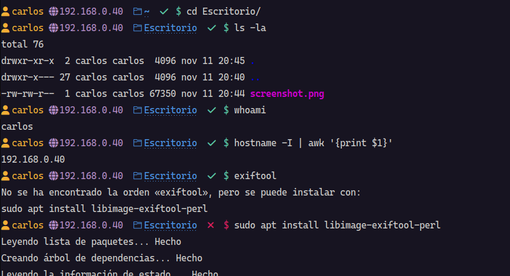

# Customize-shell

Script que aplica una configuración de estilos moderna para la shell bash. Para configurar la shell se hace uso del paquete oh-my-posh sobre el que se aplica una configuración predeterminada de fuente, colores y elementos en el prompt.

Este prompt muestra el nombre de usuario, la dirección IP, el directorio actual y un icono de estado que informa sobre si el último comando se ejecutó correctamente.



## Instalación

Ejecuta el siguiente comando en tu terminal bash (asegúrate de tener instalado curl `sudo apt install curl`).

```bash
curl -s https://raw.githubusercontent.com/vcharco/customize-shell/refs/heads/main/run.sh | bash -s
```

Una vez ejecutado el comando, se habrá aplicado una configuración inicial y habrá preparado el resto de elementos para que podamos terminar la personalización manualmente.

Los siguientes pasos que debemos realizar para terminar la configuración son los siguientes:

1. Abre las preferencias de la terminal.
2. Haz clik sobre el perfil activo.
3. En la pestaña Texto selecciona la tipografía CaskaydiaCove Nerd Font a 12pt.
4. En la misma pestaña selecciona en la parte de Espaciado entre celdas una altura de 1,50 y un margen de 5px. Según el sistema operativo encontrarás una funcion u otra (o las dos). Investiga las configuraciones que te ofrece y personalízaloa tu gusto ;) 
5. En la pestaña Colores desmarca la casilla de Usar colores del tema del sistema.
6. En esta misma pestaña selecciona el Esquema incluído GNOME oscuro o alguno similar de fondo oscuro.

## Otras terminales distintas a bash (experimental)
En caso de que tu terminal no sea bash (no existirá el .bashrc) y en su lugar es otra como zsh (el archivo será .zshrc), deberás añadir al final del comando la secuencia ` -- -s .zshrc` (o el archivo que corresponda según tu shell). Ojo, es muy probable que no funcione correctamente.

```bash
curl -s https://raw.githubusercontent.com/vcharco/customize-shell/refs/heads/main/run.sh | bash -s -- -s .zshrc
```
